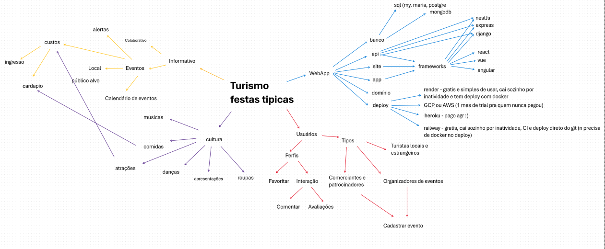

## Introdução

Um **mapa mental** é uma representação visual que organiza informações de forma hierárquica e ramificada, facilitando a conexão de ideias e o entendimento de temas complexos. No centro do mapa, coloca-se o conceito principal, e a partir dele, partem ramificações que representam subtemas ou ideias relacionadas, criando uma estrutura parecida com um diagrama. 

Esse formato permite ver rapidamente a relação entre ideias e organizar informações de forma intuitiva e criativa. Mapas mentais são amplamente utilizados para brainstorming, estudo, planejamento de projetos, e organização de conteúdo, pois ajudam a estimular a memória, o raciocínio e a criatividade, além de oferecer uma visão global e detalhada sobre um assunto. 

## Metodologia

Durante uma reunião virtual, o grupo iniciou um brainstorming e, logo em seguida, deu vida a um Mapa Mental para aprofundar e organizar todas as ideias compartilhadas sobre o futuro webApp. Cada ponto relevante e indispensável foi cuidadosamente adicionado ao mapa, que aos poucos tomou forma, capturando o essencial do projeto. Assim, o Mapa Mental foi finalizado, consolidando tudo o que não poderia faltar no desenvolvimento do app. Todo Mapa Mental foi produzido no aplicativo whiteboard.

## Mapa Mental

Abaixo temos o Mapa Mental do projeto:

Fonte: Todos os integrantes, 2024.

# Referências Bibliográficas 
SERRANO, Milene. VideoAula - DSW-Base - Mapa Mental. Acesso em: 28 de outubro de 2024.

Canal SejaUmaPessoaMelhor, Como fazer um MAPA MENTAL Passo a Passo | Seja Um Estudante Melhor. Disponível em: https://www.youtube.com/watch?v=m1qW0wPJV1M&t=1s. Acesso em: 31 de outubro de 2024. 

# Histórico de Versão

| Data       | Versão | Descrição             | Autor(es)          | Revisor(es) | Detalhes da Revisão|
|------------|--------|-----------------------|--------------------| :---:|:---:|
| 03.11.2024 | `1.0`    | Documentação do Artefato  | [Pedro Paulo][PedroPGH] | [Cláudio Henrique][ClaudioGH]| Foi solicitado que adicionasse seções de Introdução, Metodologia e Referências. Correção das fontes também. |
| 03.11.2024 | `1.1`    | Correção das seções  | [Pedro Paulo][PedroPGH] | [Cláudio Henrique][ClaudioGH]| Artefato corrigido e revisado.  |

[AnaGH]: https://github.com/analufernanndess
[CainaGH]: https://github.com/freitasc
[ClaudioGH]: https://github.com/claudiohsc
[EliasGH]: https://github.com/EliasOliver21
[GuilhermeGH]: https://github.com/gmeister18
[JoelGH]: https://github.com/JoelSRangel
[KathlynGH]: https://github.com/klmurussi
[PabloGH]: https://github.com/pabloheika
[PedroRGH]: https://github.com/pedro-rodiguero
[PedroPGH]: https://github.com/Pedrin0030
[SamuelGH]: https://github.com/samuelalvess
[TalesGH]: https://github.com/TalesRG