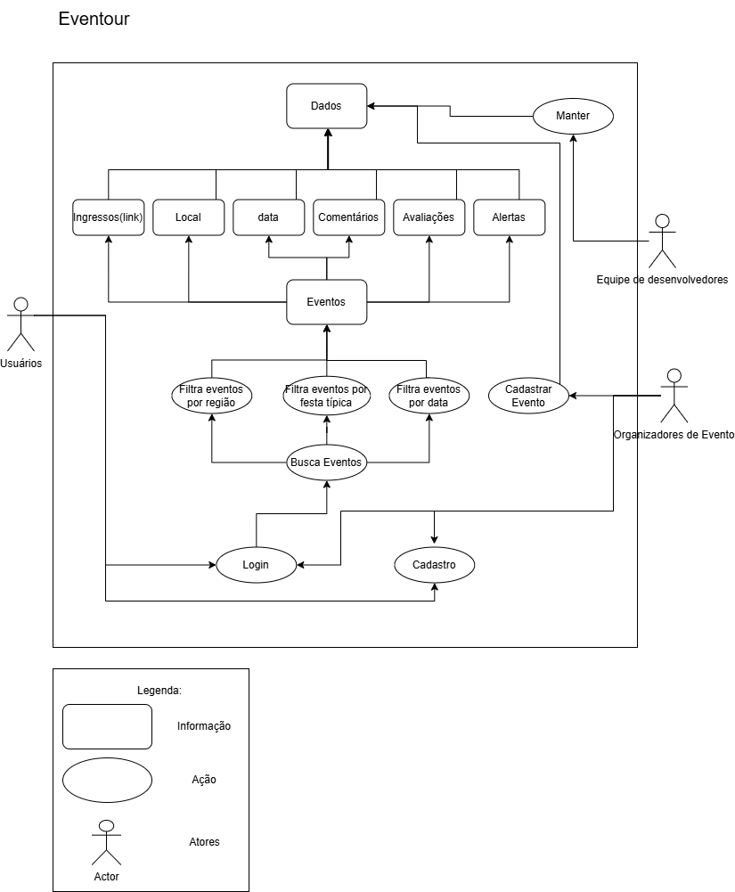

# Rich Picture

## Introdução

O Rich Picture é uma forma visual e informal para expressar ideias e analisar problemas de maneira que facilite o entendimento. No âmbito da Engenharia de Software, o Rich Picture é utilizado a fim de desenvolver uma compreensão compartilhada dos elementos-chave e das relações de um sistema. Ele possui 5 principais elementos básicos como: atores, operações ou processos, armazenamento de dados, setas e limites do sistema.

## Metodologia

Para realizar os Rich Pictures foi realizado uma reunião e uma discussão após um Mapa Mental feito em grupo, para assim conseguirmos ter uma visão geral dos elementos básicos a serem trabalhados. Alguns Rich Pictures foram feitos com a aplicação Draw.io e outros foram feitos à mão.

## Rich Picture

A aplicação Draw.io foi utilizada para elaborar o Rich Picture final do EvenTour, e está apresentado na Figura 1.

Figura 1: Rich Picture final.

Fonte: [Cláudio Henrique][ClaudioGH], 2024.

## Realizados pelo Grupo

Abaixo estão os Rich Pictures realizados pelos integrantes do grupo 5.

Figura 2: Rich Picture - Ana.

Fonte: [Ana Luiza][AnaGH], 2024.

Figura 3: Rich Picture - Cainã.

Fonte: [Cainã Freitas][CainaGH], 2024.

Figura 4: Rich Picture - Cláudio.

Fonte: [Cláudio Henrique][ClaudioGH], 2024.

Figura 5: Rich Picture - Elias.

Fonte: [Elias Oliveira][EliasGH], 2024.

Figura 6: Rich Picture - Joel.

Fonte: [Joel Rangel][JoelGH], 2024.

Figura 7: Rich Picture - Kathlyn.

Fonte: [Kathlyn Lara][KathlynGH], 2024.

Figura 8: Rich Picture - Pablo.

Fonte: [Pablo Costa][PabloGH], 2024.

Figura 9: Rich Picture - Pedro Paulo.

Fonte: [Pedro Paulo][PedroPGH], 2024.

Figura 10: Rich Picture - Tales.

Fonte: [Tales Rodrigues][TalesGH], 2024.

## Bibliografia

> 1. MONK, Andrew; HOWARD, Steve. Methods & tools: the rich picture: a tool for reasoning about work context. York: na, 1998

> 2. The Open University. Rich Picture. Disponivel: <https://www.open.edu/openlearn/science-maths-technology/engineering-technology/rich-pictures>

# Histórico de Versões

Versão  | Data | Descrição | Autor(es) | Revisor(es)
-------- | ------ | ------ | ---------- | ----------
`1.0` | 02/11/2024 | Adicionando artefato do Rich Picture  | [Claudio Henrique][ClaudioGH] e [Elias Faria][EliasGH] | |

[AnaGH]: https://github.com/analufernanndess
[CainaGH]: https://github.com/freitasc
[ClaudioGH]: https://github.com/claudiohsc
[EliasGH]: https://github.com/EliasOliver21
[GuilhermeGH]: https://github.com/gmeister18
[JoelGH]: https://github.com/JoelSRangel
[KathlynGH]: https://github.com/klmurussi
[PabloGH]: https://github.com/pabloheika
[PedroRGH]: https://github.com/pedro-rodiguero
[PedroPGH]: https://github.com/Pedrin0030
[SamuelGH]: https://github.com/samuelalvess
[TalesGH]: https://github.com/TalesRG

