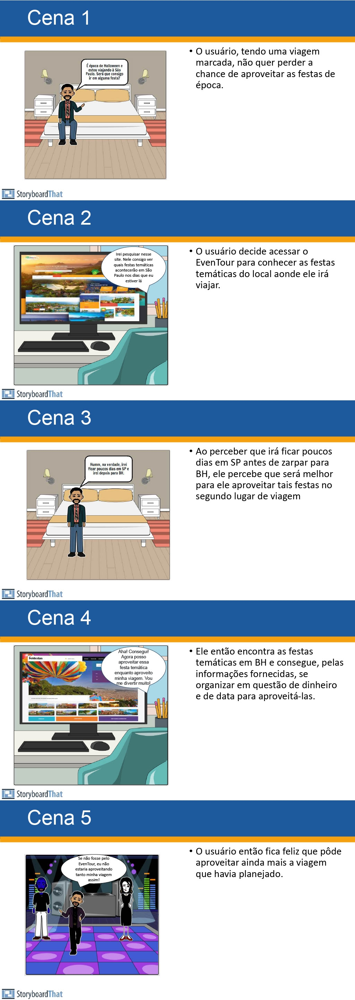

## Introdução

Um storyboard é um esboço que apresenta ilustrações sequenciais que contam uma narrativa nos mostrando previamente a representação de algo que poderá ser trago a realidade. O storyboard deve possuir uma narrativa coesa e ter um problema/situação e ao final apresentar a solução.

## Metodologia

Cada membro do grupo realizou seu próprio esboço apresentando uma situação/problema que poderia ser sanada utilizando a nossa futura aplicação, o Webapp Eventour. Cada integrante tentou focar diferentes possíveis funcionalidades que o WebApp poderá ter.

## Storyboards

Abaixo temos o storyboard de cada integrante do grupo e o objetivo de cada :

#### Ana Luiza

#### Cainã

#### Claudio

#### Elias

#### Guilherme

#### Joel

#### Kathlyn Lara

#### Pablo

#### Pedro Paulo

#### Samuel

#### Tales

## Histórico de Versão

| Versão | Data | Descrição | Autor | Revisor
|:-:|:-:|:-:|:-:|:-:|
|`1.0`| 02/11/2024 | Criação do documento| [Elias Oliveira][EliasGH] |  |

[AnaGH]: https://github.com/analufernanndess
[CainaGH]: https://github.com/freitasc
[ClaudioGH]: https://github.com/claudiohsc
[EliasGH]: https://github.com/EliasOliver21
[GuilhermeGH]: https://github.com/gmeister18
[JoelGH]: https://github.com/JoelSRangel
[KathlynGH]: https://github.com/klmurussi
[PabloGH]: https://github.com/pabloheika
[PedroGH]: https://github.com/pedro-rodiguero
[PedroGH]: https://github.com/pabloheika
[SamuelGH]: https://github.com/samuelalvess
[TalesGH]: https://github.com/TalesRG