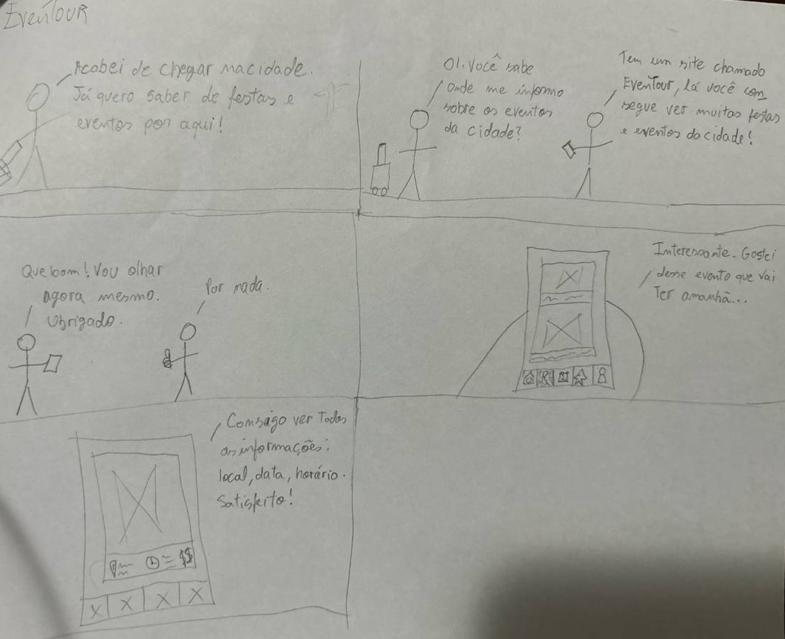
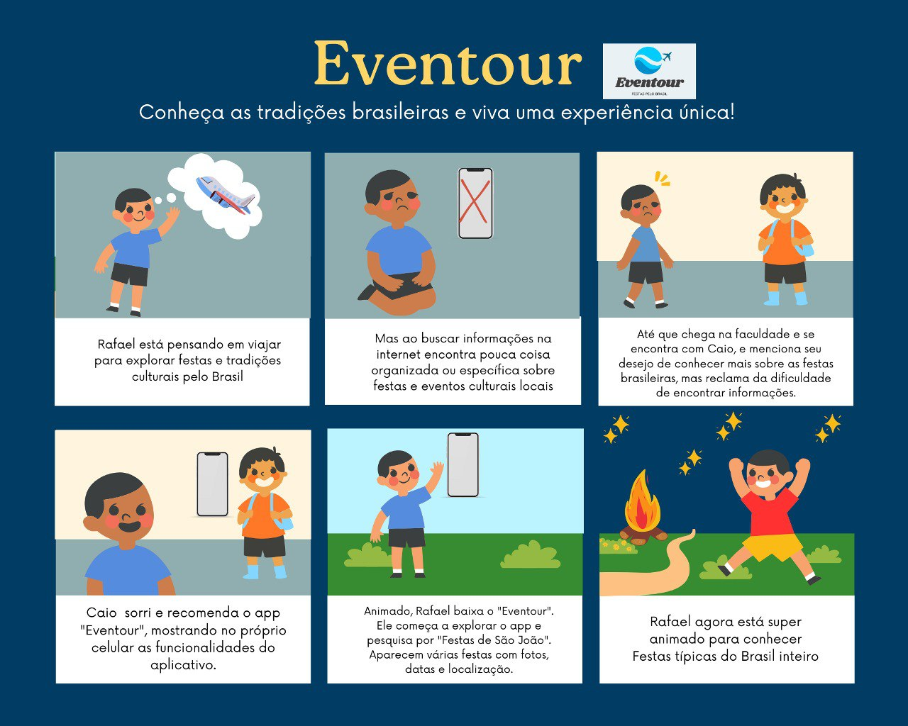
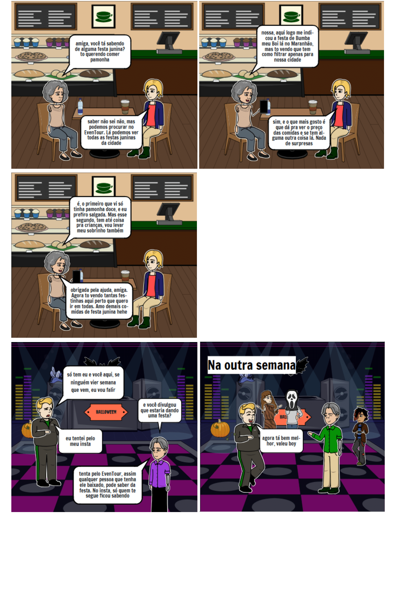
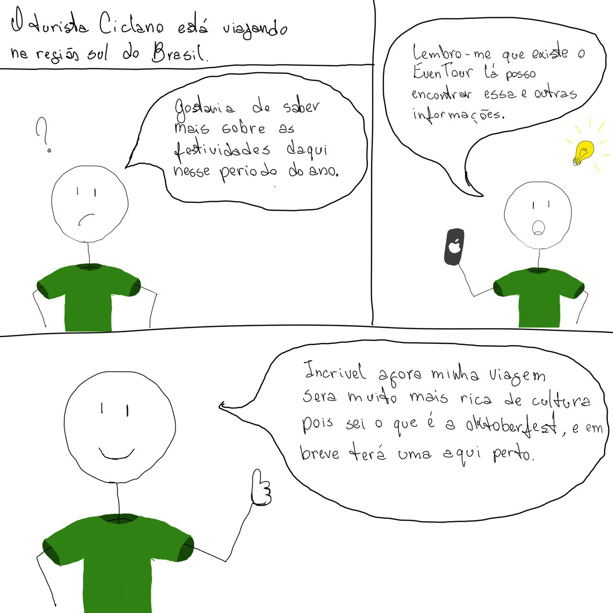
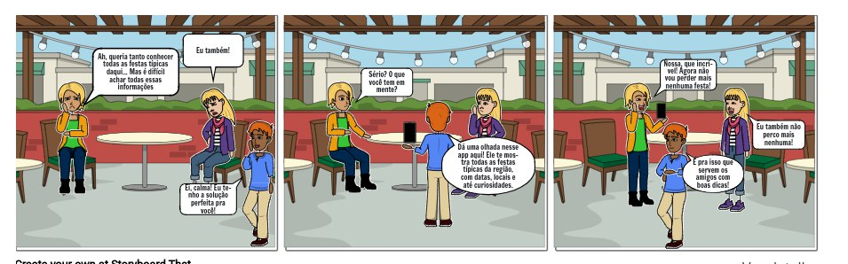
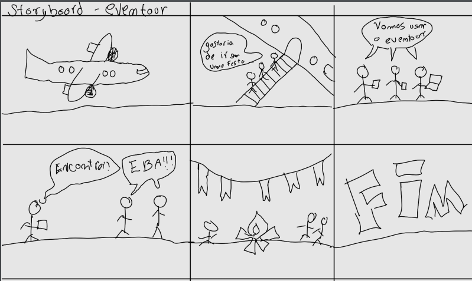

## Introdução

Um storyboard é um esboço que apresenta ilustrações sequenciais que contam uma narrativa nos mostrando previamente a representação de algo que poderá ser trago a realidade. O storyboard deve possuir uma narrativa coesa e ter uma situação/problema que ao final é solucionada demonstrando a utilização e finalidade do produto apresentada.

## Metodologia

Cada membro do grupo realizou seu próprio esboço, apresentando uma situação/problema que poderia ser sanada utilizando a nossa futura aplicação, o Webapp Eventour. Cada integrante tentou focar em diferentes possíveis cenários que o Webapp poderá ser utilizado.

## Storyboards

Abaixo temos o storyboard de cada integrante do grupo:

#### Ana Luiza

#### Cainã

](assets/storyboards/caina.png)

#### Claudio

#### Elias

#### Guilherme

#### Joel

#### Kathlyn Lara

#### Pablo

#### Pedro Paulo

#### Samuel

#### Tales

## Histórico de Versão

| Versão | Data | Descrição | Autor(es) | Revisor(es) | Detalhes da revisão |
| :----: | :--: | --------- | ----------- | ------ | :---: |
|`1.0`| 02/11/2024 | Criação do documento| [Elias Oliveira][EliasGH] e [Claudio Henrique][ClaudioGH] | [Cainã Freitas][CainaGH] | Corrigi imagem quebrada e histórico fora do modelo |
|`1.1`| 04/11/2024 | Atualização e Melhoria | [Elias Oliveira][EliasGH] e [Claudio Henrique][ClaudioGH] | [Pedro Paulo][PedroPGH] | O artefato não apresenta erros. Consertei somente os links do autor para melhor padronização. |

[AnaGH]: https://github.com/analufernanndess
[CainaGH]: https://github.com/freitasc
[ClaudioGH]: https://github.com/claudiohsc
[EliasGH]: https://github.com/EliasOliver21
[GuilhermeGH]: https://github.com/gmeister18
[JoelGH]: https://github.com/JoelSRangel
[KathlynGH]: https://github.com/klmurussi
[PabloGH]: https://github.com/pabloheika
[PedroGH]: https://github.com/pedro-rodiguero
[PedroPGH]: https://github.com/Pedrin0030
[PedroGH]: https://github.com/pabloheika
[SamuelGH]: https://github.com/samuelalvess
[TalesGH]: https://github.com/TalesRG
