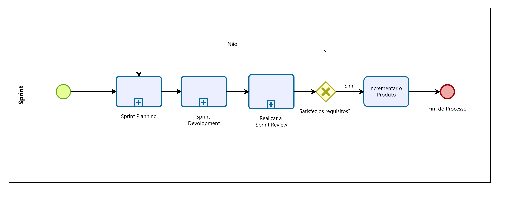
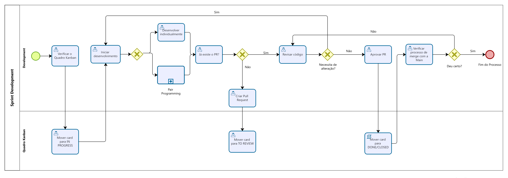
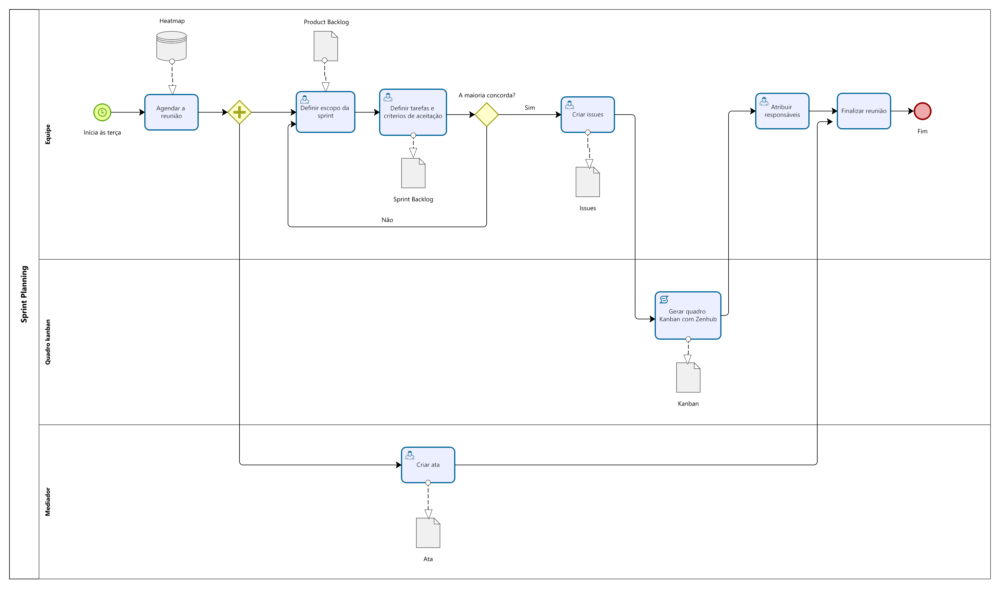
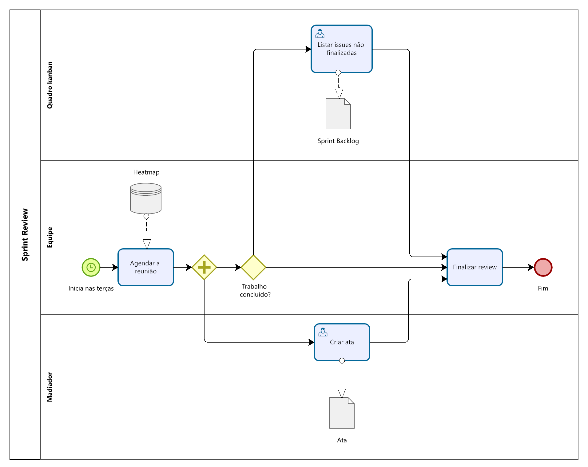
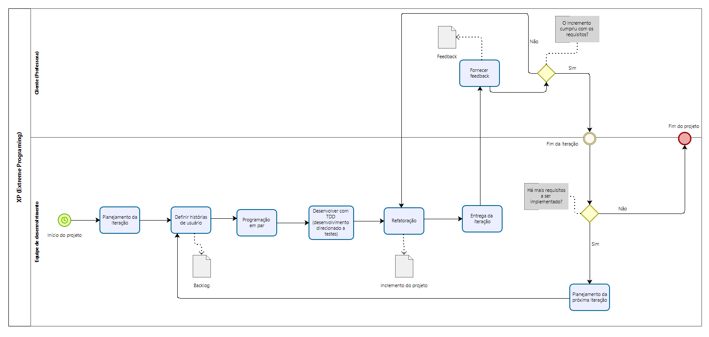
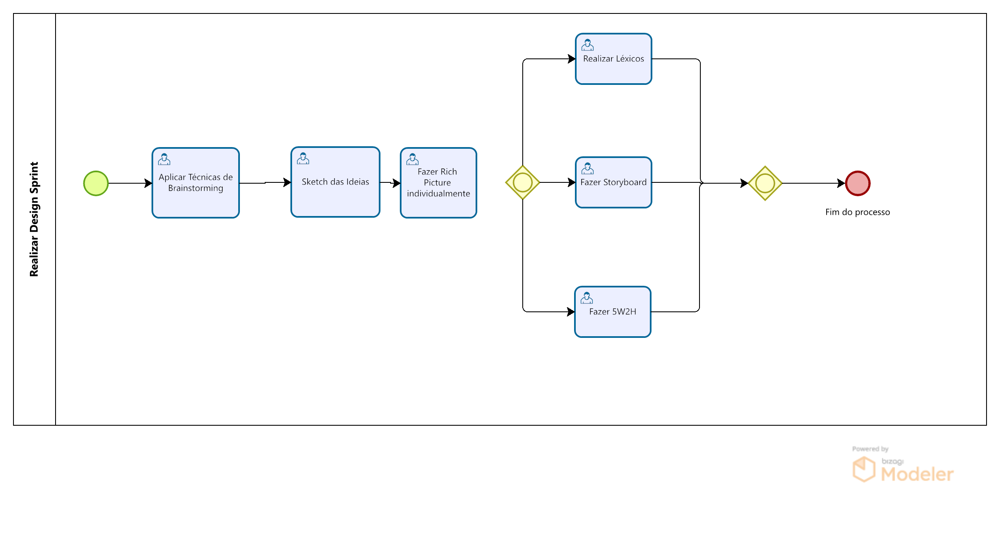

# Modelagem BPMN

## Metodologia

 
A BPMN (Business Process Model and Notation) é uma forma gráfica de representar processos por meio de diagramas, seguindo um padrão específico de modelagem. Esse padrão inclui símbolos e regras que possibilitam modelar fluxos de processos com diferentes níveis de detalhe.
  
Com a BPMN, é possível criar processos de negócios, definir melhorias em processos existentes, documentar e compartilhar esses processos (novos ou já estabelecidos). Ela permite definir novos processos e fluxos de trabalho, apoiar a identificação de requisitos de software (especialmente na área de TI) e automatizar processos.
  
A modelagem com BPMN é eficiente pois proporciona uma visão gráfica dos fluxos de tarefas, facilitando a compreensão do processo de negócio. Isso permite visualizar cada etapa, identificar os responsáveis e entender o funcionamento do negócio, além de ajudar na identificação de pontos que podem ser aprimorados.

 

## Processos do projeto

Os diagramas BPMN foram feitos com base nas metodologias escolhidas pelo grupo, e estas são: Scrum, Kanban e XP.
No Scrum fizemos uma adaptação onde não utilizaremos alguns pontos da metodologia, como: Product Owner, Daily e Scrum Master. E da metodologia XP vamos utilizar somente a parte de Pair Programming.

Os diagramas a seguir representam como é realizado cada um dos processos envolvidos.
 

## Sprint

<figcaption align='center'>
    <b>Figura 1: Processo de Sprint Geral</b>
     
</figcaption>

Fonte: [Elias F. Oliveira](https://github.com/EliasOliver21) e [Claudio Henrique](https://github.com/claudiohsc), 2024.

## Sprint Development

<figcaption align='center'>
    <b>Figura 2: Processo de Sprint Development</b>
     
</figcaption>

Fonte: [Elias F. Oliveira](https://github.com/EliasOliver21) e [Claudio Henrique](https://github.com/claudiohsc), 2024.

## Sprint Planning

<figcaption align='center'>
    <b>Figura 3: Processo de Sprint Planning</b>
</figcaption>
 

 Fonte: [Ana Luíza][AnaGH],[Cainã Fretias][CainaGH],[Kathlyn Lara][KathlynGH], [Pablo S.][PabloGH] e [Pedro Paulo][PedroPGH], 2024.

## Sprint Review

<figcaption align='center'>
    <b>Figura 4: Processo de Sprint Review </b>
</figcaption>
 

 Fonte: [Ana Luíza][AnaGH],[Cainã Fretias][CainaGH],[Kathlyn Lara][KathlynGH], [Pablo S.][PabloGH] e [Pedro Paulo][PedroPGH], 2024.

## XP (Extreme Programing) - Pair Programming

<figcaption align='center'>
    <b>Figura 5: Processo de Sprint Review </b>
</figcaption>
 

 Fonte: [Joel Soares][JoelGH] e [Samuel Alves][SamuelGH], 2024.

## Sprint Design

<figcaption align='center'>
    <b>Figura 5: Processo de Sprint Design </b>
</figcaption>
 

 Fonte: [Guilherme Meister][GuilhermeGH], 2024.

## Gravações da realização dos diagramas

 Vídeo 1: Realização do Diagrama da Sprint e Sprint Development.

<iframe width="560" height="315" src="https://www.youtube.com/embed/CjMWtU5_BH8" title="YouTube video player" frameborder="0" allow="accelerometer; autoplay; clipboard-write; encrypted-media; gyroscope; picture-in-picture; web-share" referrerpolicy="strict-origin-when-cross-origin" allowfullscreen></iframe>

Fonte: [Claudio Henrique](https://github.com/claudiohsc) e [Elias F. Oliveira](https://github.com/EliasOliver21), 2024.

 Vídeo 2: Realização do Diagrama da Sprint Review e Sprint Planning.

<iframe width="560" height="315" src="https://www.youtube.com/embed/Vbmy7QDjG6Y" title="YouTube video player" frameborder="0" allow="accelerometer; autoplay; clipboard-write; encrypted-media; gyroscope; picture-in-picture; web-share" referrerpolicy="strict-origin-when-cross-origin" allowfullscreen></iframe>

 Fonte: [Ana Luíza][AnaGH],[Cainã Fretias][CainaGH],[Kathlyn Lara][KathlynGH], [Pablo S.][PabloGH] e [Pedro Paulo][PedroPGH], 2024.

### Referências

SERANO, Milene. **BPMN**, 2024. Vídeo-aulas complementares apresentadas na Disciplina de Arquitetura e Desenho de Software do curso de engenharia de software da UnB, FGA. Acesso em 03 de novembro de 2024.

EUAX CONSULTING. **O que é BPMN (Business Process Model and Notation) e como aplicar essa notação na Modelagem de Processos**. Disponível em: [https://www.euax.com.br/2017/02/o-que-e-bpmn-business-process-model-and-notation/](https://www.euax.com.br/2017/02/o-que-e-bpmn-business-process-model-and-notation/). Acesso em 03 de novembro de 2024.

# Histórico de Versão

| Versão | Data | Descrição | Autor(es) | Revisor(es) | Detalhes da revisão |
| :----: | :--: | --------- | ----------- | ------ | :---: |
| 1.0  | 03/11/2024 | Criação do documento | [Cainã Valença de Freitas][CainaGH]  | [Guilherme Meister][GuilhermeGH] |Consertei somente o Histórico de Versão para melhor padronização. |
| 1.1  | 03/11/2024 | Reescreve documento | [Cainã Valença de Freitas][CainaGH]  | [Guilherme Meister][GuilhermeGH] |Consertei somente o Histórico de Versão para melhor padronização. |
| 1.2  | 03/11/2024 | Adicionando novas imagens | [Cláudio Henrique][ClaudioGH]  | [Guilherme Meister][GuilhermeGH] |Consertei somente as referências. |
| 1.3  | 03/11/2024 | Adicionando os vídeos | [Cláudio Henrique][ClaudioGH]  | [Guilherme Meister][GuilhermeGH] | Apenas testei os vídeos. |
| 1.4  | 03/11/2024 | Adicionando novo BPMN | [Guilherme Meister][GuilhermeGH]  |  |  |

[AnaGH]: https://github.com/analufernanndess
[CainaGH]: https://github.com/freitasc
[ClaudioGH]: https://github.com/claudiohsc
[EliasGH]: https://github.com/EliasOliver21
[GuilhermeGH]: https://github.com/gmeister18
[JoelGH]: https://github.com/JoelSRangel
[KathlynGH]: https://github.com/klmurussi
[PabloGH]: https://github.com/pabloheika
[PedroRGH]: https://github.com/pedro-rodiguero
[PedroPGH]: https://github.com/Pedrin0030
[SamuelGH]: https://github.com/samuelalvess
[TalesGH]: https://github.com/TalesRG