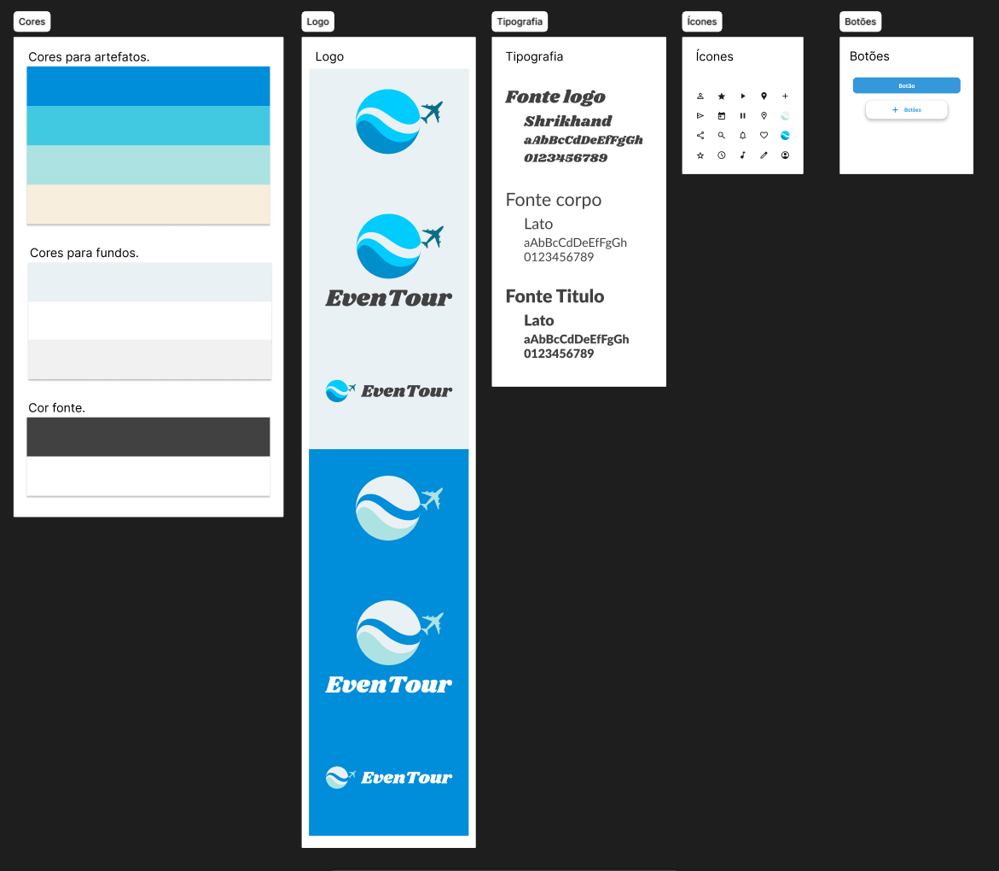

## Introdução

O guia de estilo é um modelo criado para a padronização no desenvolvimento de um projeto, levando em conta características como: paleta de cores, tipografia, iconografia, logo, entre outros.

## Metodologia

A criação do guia de estilo se deu levando em consideração o livro IHC de Barbosa e Silva. O guia de estilo foi criado utilizando a ferramenta [Figma](docs\Base\1.5.3.FerramentasUtilizadas.md) para ser utilizado na criação do protótipo de alta fidelidade. Foi utilizado na criação do guia de estilo o [Material Design](https://m3.material.io) da Google que é um sistema de design de interfaces gráficas.

## Guia de estilo criado

<iframe style="border: 1px solid rgba(0, 0, 0, 0.1);" width="800" height="450" src="https://embed.figma.com/design/Sqv6j3v06RgzAIbtZvjCRR/EvenTour---ArqDSW?node-id=2-2&embed-host=share" allowfullscreen></iframe>

Fonte: [Pablo Costa][PabloGH] e [Joel Rangel][JoelGH], 2024.

## Referências Bibliográficas

Barbosa, S. D. J.; Silva, B. S. da; Silveira, M. S.; Gasparini, I.; Darin, T.; Barbosa, G. D. J. (2021) Interação Humano-Computador e Experiência do usuário. Autopublicação. ISBN: 978-65-00-19677-1. p. 257.

## Bibliografia

Barbosa, S. D. J.; Silva, B. S. da; Silveira, M. S.; Gasparini, I.; Darin, T.; Barbosa, G. D. J. (2021) Interação Humano-Computador e Experiência do usuário. Autopublicação. ISBN: 978-65-00-19677-1.

## Histórico de Versões

| Versão | Data | Descrição | Autor(es) | Revisor(es) | Detalhes da revisão |
| :----: | :--: | --------- | ----------- | ------ | :---: |
| 1.0  | 02/11/2024 | Criação do documento | [Pablo][PabloGH], [Joel][JoelGH], [Elias Oliveira][EliasGH] e [ClaudioGH][ClaudioGH] | [Cainã Freitas][CainaGH] | O artefato não apresenta erros. Consertei somente os links do autor para melhor padronização. |

[AnaGH]: https://github.com/analufernanndess
[CainaGH]: https://github.com/freitasc
[ClaudioGH]: https://github.com/claudiohsc
[EliasGH]: https://github.com/EliasOliver21
[GuilhermeGH]: https://github.com/gmeister18
[JoelGH]: https://github.com/JoelSRangel
[KathlynGH]: https://github.com/klmurussi
[PabloGH]: https://github.com/pabloheika
[PedroRGH]: https://github.com/pedro-rodiguero
[PedroPGH]: https://github.com/Pedrin0030
[SamuelGH]: https://github.com/samuelalvess
[TalesGH]: https://github.com/TalesRG
