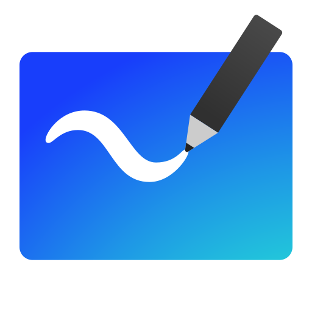
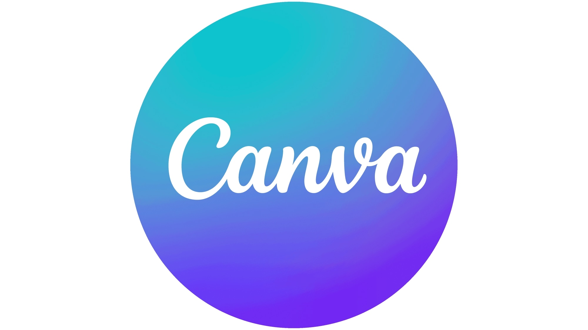
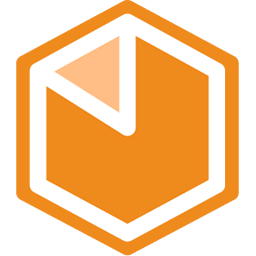

## Ferramentas Utilizadas

Para o desenvolvimento dos artefatos criados neste projeto, foram utilizadas as seguintes ferramentas:

### [Microsoft Whiteboard](https://whiteboard.microsoft.com)

O Microsoft Whiteboard é um aplicativo de colaboração digital que permite criar e compartilhar quadros brancos interativos, facilitando brainstormings e reuniões em equipe em tempo real.

Foi utilizada no projeto para a realização do Brainstorm, Mapa Mental e Diagrama de Causa e Efeito.

## [GitHub](https://github.com)

O GitHub é uma plataforma de hospedagem de código-fonte que facilita o controle de versão e a colaboração entre desenvolvedores. Com ele, é possível armazenar, gerenciar e compartilhar projetos de software, além de integrar ferramentas para desenvolvimento colaborativo.

Foi utilizado com a finalidade de hospedar todo o projeto, onde os integrantes contribuíram com documentação e código.

## [Discord](https://discord.com)

O Discord é uma plataforma de comunicação digital projetada inicialmente para comunidades de gamers, mas que se expandiu para atender diversos grupos e interesses. Ele combina recursos de voz, vídeo e mensagens de texto em uma interface que permite a criação de servidores – espaços dedicados onde os usuários podem interagir em canais temáticos.

O uso do discord se deu principalmente para reuniões não gravadas e trabalho em conjunto da equipe, agilizando a comunicação.

## [Microsoft Teams](https://www.microsoft.com/pt-br/microsoft-teams/group-chat-software)

O Microsoft Teams é uma plataforma de colaboração e comunicação desenvolvida pela Microsoft, projetada para integrar diversas ferramentas de produtividade e facilitar o trabalho em equipe.

O microsoft teams foi utilizado principalmente para realizar as apresentações e documetação das diversas etapas que o grupo realizou em conjunto.

## [Telegram](https://web.telegram.org)

O Telegram é um aplicativo de mensagens instantâneas focado em velocidade, segurança e flexibilidade, fundado em 2013 pelos irmãos Nikolai e Pavel Durov. Ele oferece recursos similares a outras plataformas de mensagens, como envio de texto, voz, vídeo e arquivos, mas se destaca por suas funcionalidades avançadas e foco em privacidade.

O telegram foi utilizado para a comunicação rápida do grupo, facilitando o início da organização e o envio de arquivos.

## [Visual Studio Code](https://code.visualstudio.com)

O Visual Studio Code (VS Code) é um editor de código-fonte desenvolvido pela Microsoft, popular entre desenvolvedores por sua leveza, versatilidade e ampla gama de funcionalidades. Lançado em 2015, o VS Code é de código aberto e gratuito, e se tornou um dos editores mais usados por programadores de diferentes níveis e áreas, desde desenvolvimento web até ciência de dados.

O VS Code foi utilizado como principal ferramenta de desenvimento, tanto para a documentação e a futura aplicação.

## [Canva](https://www.canva.com/)

O Canva é uma plataforma de design gráfico online que permite a criação de diversos tipos de materiais visuais de forma fácil e intuitiva, mesmo para quem não tem experiência em design. Lançado em 2013, o Canva se tornou popular por oferecer uma interface amigável e uma vasta biblioteca de templates, imagens, ícones, fontes e outros elementos visuais.

O canva foi utilizado para criar o design da logo da aplicação a ser desenvolvida.

## [Figma](https://www.figma.com/)

O Figma é uma ferramenta de design de interface e prototipagem baseada na web que permite a colaboração em tempo real entre equipes. Lançado em 2016, tornou-se popular entre designers e desenvolvedores por suas funcionalidades que facilitam a criação de interfaces de usuário (UI) e experiências de usuário (UX).

O Figma foi utilizado no desenvolvimento do prototipo de alta fidelidade mobile e Web.

## [Bizagi Modeler](https://www.bizagi.com/pt/plataforma/modeler)

O Bizagi é uma plataforma de Business Process Management (BPM) que permite às empresas modelar, automatizar e otimizar seus processos de negócios. Fundada em 1989, a ferramenta se destaca por proporcionar uma abordagem intuitiva e visual para o mapeamento de processos, facilitando tanto para equipes técnicas quanto para usuários de negócios.

Foi utilizado para produzir os diagramas em BPMN que apresentam a metodologia adaptada e utilizada pela equipe.

## Histórico de Versão
| Versão | Data | Descrição | Autor | Revisor|
|:-:|:-:|:-:|:-:|:-:|
|`1.0`| 03/11/2024 | Criação do documento de Ferramentas | [Cláudio Henrique][ClaudioGH] e [Elias Oliveira][EliasGH] |  |

[AnaGH]: https://github.com/analufernanndess
[CainaGH]: https://github.com/freitasc
[ClaudioGH]: https://github.com/claudiohsc
[EliasGH]: https://github.com/EliasOliver21
[GuilhermeGH]: https://github.com/gmeister18
[JoelGH]: https://github.com/JoelSRangel
[KathlynGH]: https://github.com/klmurussi
[PabloGH]: https://github.com/pabloheika
[PedroRGH]: https://github.com/pedro-rodiguero
[PedroPGH]: https://github.com/Pedrin0030
[SamuelGH]: https://github.com/samuelalvess
[TalesGH]: https://github.com/TalesRG