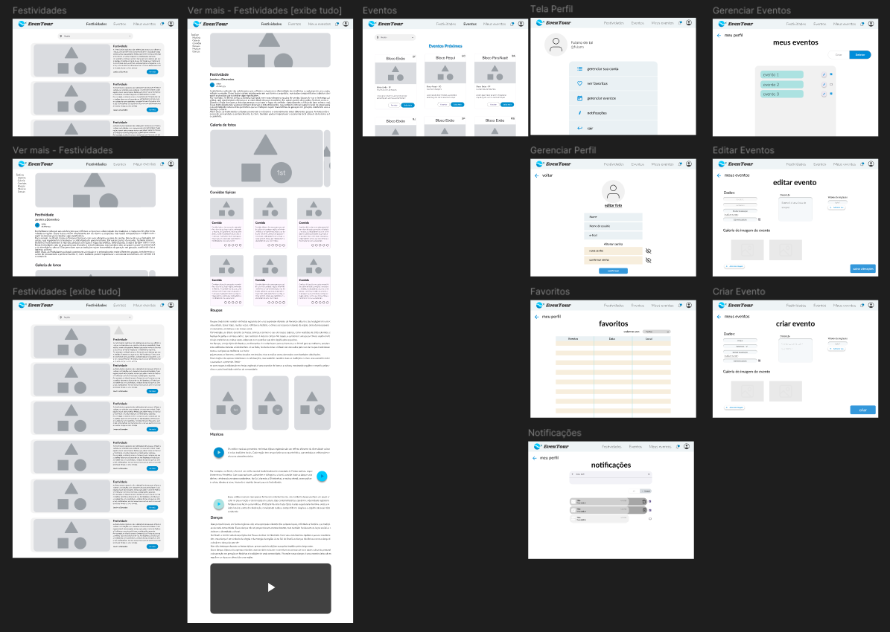
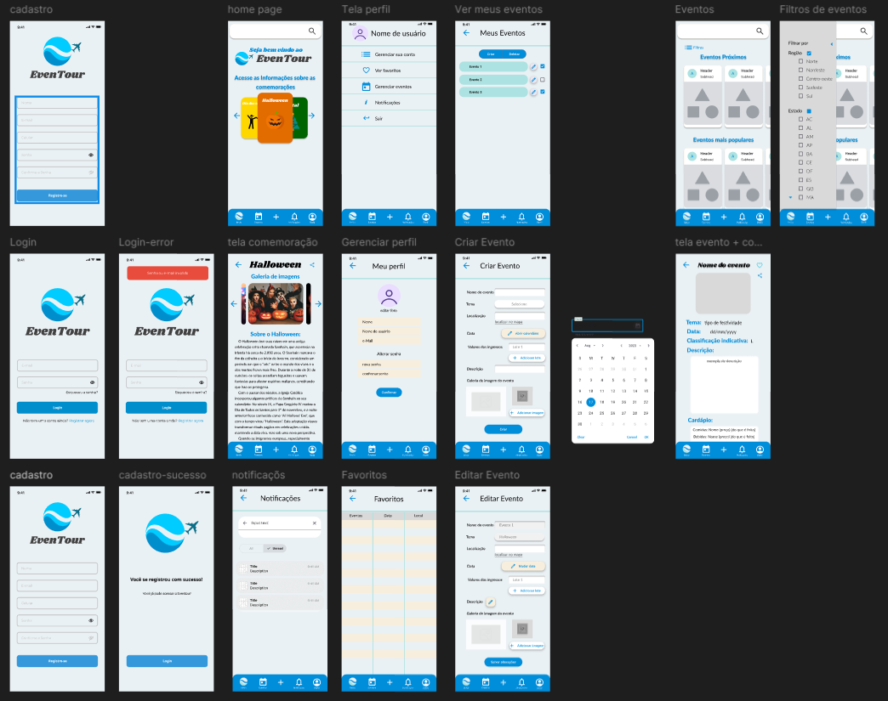
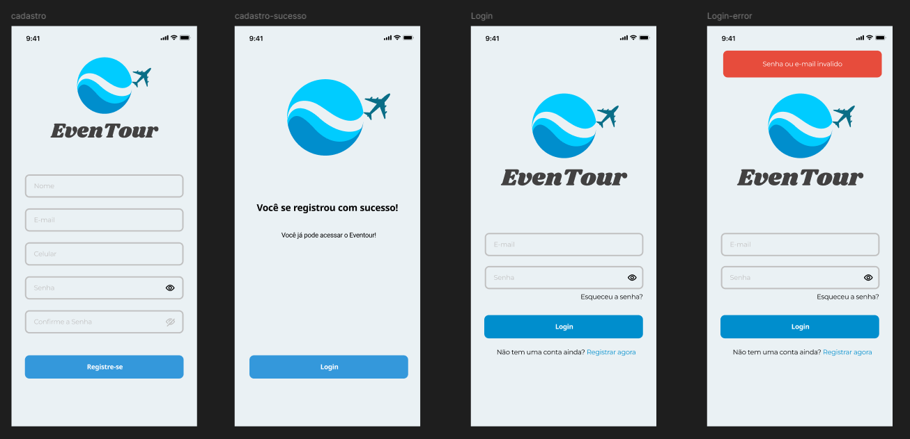
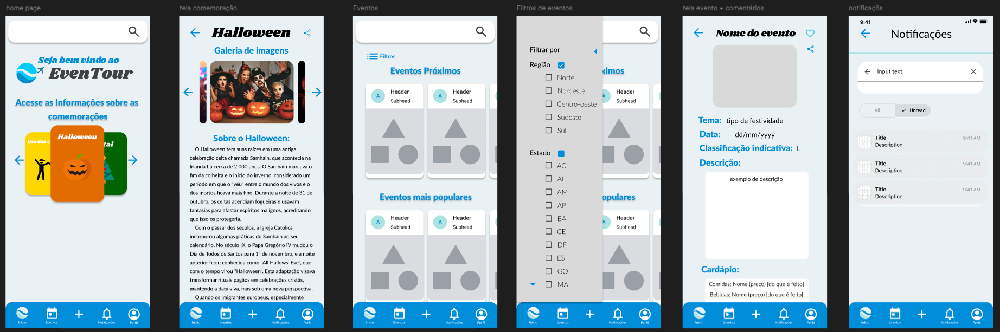
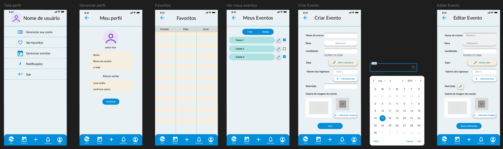
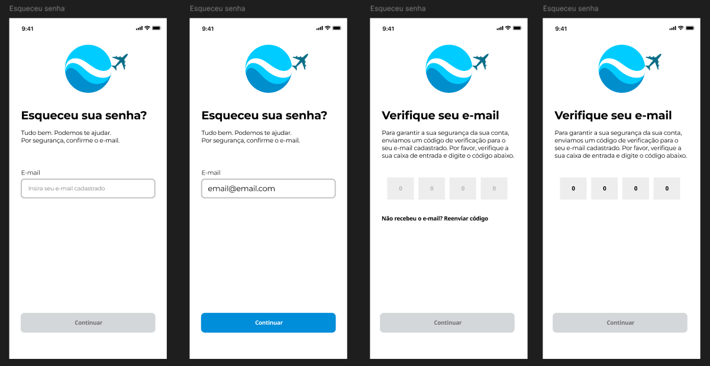

# Protótipo de Alta Fidelidade

## Introdução

Um protótipo de alta fidelidade é uma representação visual e interativa de um produto ou sistema que imita de perto o produto final em questões de design e interatividade. Criados geralmente com ferramentas de design gráfico e prototipagem, esses protótipos podem incluir elementos detalhados como cores, tipografia, imagens e interações complexas.

A principal finalidade de um protótipo de alta fidelidade é proporcionar uma visão mais precisa de como o produto final se apresentará. Eles são úteis quando a equipe busca validar e aprimorar a experiência do usuário com certa funcionalidade do sistema.

## Metodologia

Neste documento está o protótipo desenvolvido na ferramenta [FIGMA](https://www.figma.com/)

## Protótipo de Alta Fidelidade

### Desktop

Abaixo na figura 01 é mostrado o protótipo de alta fidelidade da versão desktop e logo abaixo temos o protótipo direto com a ferramenta figma.

Figura 01: Protótipo de Alta Fidelidade - Desktop

 Fonte: [Joel Soares][JoelGH] 

Protótipo de Alta fidelidade - Desktop

<iframe style="border: 1px solid rgba(0, 0, 0, 0.1);" width="800" height="450" src="https://embed.figma.com/design/Sqv6j3v06RgzAIbtZvjCRR/EvenTour---ArqDSW?node-id=0-1&embed-host=share" allowfullscreen></iframe>

 Fonte: [Joel Soares][JoelGH]

### Mobile

Abaixo na figura 02 é mostrado o protótipo de alta fidelidade da versão Mobile e logo abaixo temos o protótipo direto com a ferramenta figma.

Figura 02: Protótipo de Alta Fidelidade - Mobile

 Fonte: [Joel Soares][JoelGH] 

Protótipo de Alta fidelidade - Mobile

<iframe style="border: 1px solid rgba(0, 0, 0, 0.1);" width="800" height="450" src="https://embed.figma.com/design/Sqv6j3v06RgzAIbtZvjCRR/EvenTour---ArqDSW?node-id=4-2&embed-host=share" allowfullscreen></iframe>

 Fonte: [Joel Soares][JoelGH]

#### Login e Cadastro

Abaixo na figura 03 é mostrado o protótipo de alta fidelidade da versão Mobile da tela de login e cadastro.

Figura 03: Protótipo de Alta Fidelidade - Mobile - Telas de Login e Cdastro

 Fonte: [Joel Soares][JoelGH] 

#### Home, culturas e eventos

Abaixo na figura 04 é mostrado o protótipo de alta fidelidade da versão Mobile das telas de Home, culturas e eventos.

Figura 04: Protótipo de Alta Fidelidade - Mobile - Home, culturas e eventos 

 Fonte: [Joel Soares][JoelGH] 

#### Perfil, favoritos e adicionar/editar eventos

Abaixo na figura 05 é mostrado o protótipo de alta fidelidade da versão Mobile das telas de Perfil, favoritos e adicionar/editar eventos.

Figura 05: Protótipo de Alta Fidelidade - Mobile - Perfil, favoritos e adicionar/editar eventos 

 Fonte: [Joel Soares][JoelGH] 

#### Esqueceu senha

Abaixo na figura 06 é mostrado o protótipo de alta fidelidade da versão Mobile das telas relacionadas ao "Esqueceu a senha".

Figura 06: Protótipo de Alta Fidelidade - Mobile - Esqueceu senha 

 Fonte: [Joel Soares][JoelGH] 

# Histórico de Versão

| Data       | Versão | Descrição             | Autor(es)          | Revisor(es) | Detalhes da Revisão|
|------------|--------|-----------------------|--------------------| :---:|:---:|
| 04/11/2024 | 1.0 | Criação do documento | [Joel Soares][JoelGH] | [Elias Oliveira][EliasGH] | Não foram encontrados erros consideráveis, apenas sendo necessárias pequenas correções nas identificações das figuras. |

[AnaGH]: https://github.com/analufernanndess
[CainaGH]: https://github.com/freitasc
[ClaudioGH]: https://github.com/claudiohsc
[EliasGH]: https://github.com/EliasOliver21
[GuilhermeGH]: https://github.com/gmeister18
[JoelGH]: https://github.com/JoelSRangel
[KathlynGH]: https://github.com/klmurussi
[PabloGH]: https://github.com/pabloheika
[PedroRGH]: https://github.com/pedro-rodiguero
[PedroPGH]: https://github.com/Pedrin0030
[SamuelGH]: https://github.com/samuelalvess