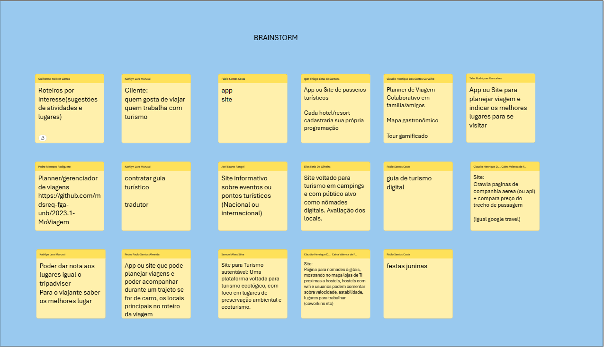

## Introdução
O brainstorm é uma técnica de geração de ideias utilizada para incentivar a criatividade e a inovação em um grupo. Essa técnica é especialmente eficaz quando o objetivo é resolver um problema específico, explorar novas oportunidades de negócios ou gerar soluções inovadoras para questões complexas. Durante uma sessão de brainstorm, os participantes são encorajados a apresentar qualquer ideia que venha à mente, sem restrições ou julgamentos. Isso permite um fluxo livre de pensamentos e conceitos, que pode levar a soluções únicas e fora do comum.

## Metodologia

Durante uma sessão de brainstorm, os participantes são incentivados a seguir algumas diretrizes básicas para garantir que a técnica seja eficaz e produtiva. Algumas das diretrizes mais comuns incluem:

- **Adiar o julgamento**: Durante a sessão de brainstorm, os participantes devem adiar o julgamento de ideias. Isso significa que todas as ideias são bem-vindas, independentemente de quão estranhas ou improváveis possam parecer.
- **Gerar o maior número possível de ideias**: Os participantes devem se concentrar em gerar o maior número possível de ideias, sem se preocupar com a qualidade ou viabilidade das mesmas.
- **Construir sobre as ideias dos outros**: Os participantes devem construir sobre as ideias uns dos outros, em vez de rejeitá-las ou ignorá-las. Isso pode levar a soluções mais inovadoras
- **Manter o foco no objetivo**: Os participantes devem manter o foco no objetivo da sessão de brainstorm e garantir que todas as ideias geradas estejam alinhadas com esse objetivo.
- **Registrar todas as ideias**: Todas as ideias geradas durante a sessão de brainstorm devem ser registradas, para que possam ser revisadas e avaliadas posteriormente.
- **Selecionar as melhores ideias**: Após a sessão de brainstorm, as ideias geradas devem ser revisadas e avaliadas para identificar as melhores soluções.
- **Incentivar a participação de todos**: Todos os participantes devem ser incentivados a contribuir com ideias e sugestões durante a sessão de brainstorm, para garantir que todas as perspectivas sejam consideradas e valorizadas.

## Brainstorm

### Tema: Desenvolvimento de um novo aplicativo relacionado a turismo

Foi realizada uma videoconferência com todos os integrantes do grupo, onde cada um apresentou suas ideias para o desenvolvimento de um novo aplicativo relacionado a turismo. As ideias foram registradas e avaliadas, e as melhores soluções foram selecionadas para serem desenvolvidas.

 Fonte: [Ana Luíza][AnaGH],[Cainã Fretias][CainaGH], [Cláudio Henrique][ClaudioGH], [Elias][EliasGH], [Guilherme][GuilhermeGH], [Joel][JoelGH], [Kathlyn Lara][KathlynGH], [Pablo S.][PabloGH] e [Pedro Paulo][PedroPGH], [Pedro Rodiquero][PedroRGH] e [Samuel][SamuelGH], 2024.

## Bibliografia

> 1. Barbosa, S. D. J.; Silva, B. S. da; Silveira, M. S.; Gasparini, I.; Darin, T.; Barbosa, G. D. J. (2021) Interação Humano-Computador e Experiência do usuário. Autopublicação. ISBN: 978-65-00-19677-1. p. 152,153.

# Histórico de Versão
| Data       | Versão | Descrição                         | Autor(es)                            | Revisor(es) | Detalhes da Revisão|
|------------|--------|-----------------------------------|--------------------------------------| :---: |:---:|
| 03.11.2024 | `1.0`    | Criação da documentação Brainstorm | [Tales Rodrigues Goncalves][TalesGH] | [Cláudio Henrique][ClaudioGH] | Foi solicitado que o autor adicionasse uma seção como Bibliografia e a fonte de todos os integrantes que realizaram o Brainstorm |
| 03.11.2024 | `1.1`    | Adição de bibliografia            | [Tales Rodrigues Goncalves][TalesGH] |[Cláudio Henrique][ClaudioGH] | Artefato revisado e corrigido. Só centralizei a fonte. [#37](https://github.com/UnBArqDsw2024-2/2024.2_G5_Turismo_Entrega_01/pull/37)|

[AnaGH]: https://github.com/analufernanndess
[CainaGH]: https://github.com/freitasc
[ClaudioGH]: https://github.com/claudiohsc
[EliasGH]: https://github.com/EliasOliver21
[GuilhermeGH]: https://github.com/gmeister18
[JoelGH]: https://github.com/JoelSRangel
[KathlynGH]: https://github.com/klmurussi
[PabloGH]: https://github.com/pabloheika
[PedroRGH]: https://github.com/pedro-rodiguero
[PedroPGH]: https://github.com/Pedrin0030
[SamuelGH]: https://github.com/samuelalvess
[TalesGH]: https://github.com/TalesRG
