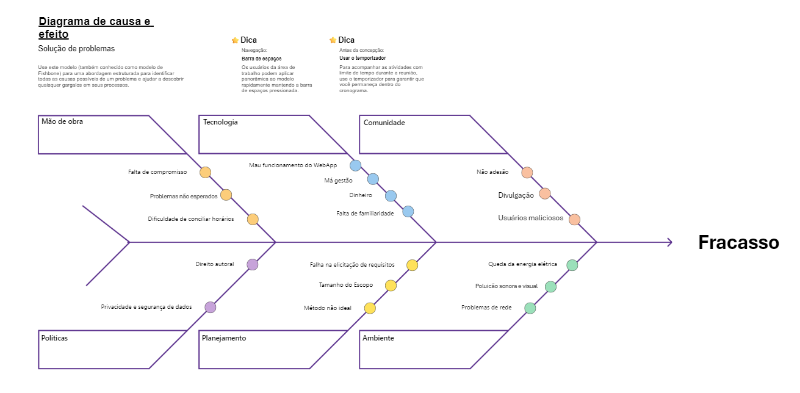

# Diagrama Causa-Efeito (Ishikawa)

## Introdução

O diagrama de causa e efeito é uma ferramenta utilizada para identificar potenciais causas de problemas em um projeto ou sistema. No contexto do projeto **EvenTour**, que se destina a ser uma plataforma informativa sobre turismo (disponível como site, aplicativo móvel ou versão desktop), esse diagrama ajudará a mapear as possíveis dificuldades no desenvolvimento e manutenção da plataforma, abordando aspectos que podem impactar sua funcionalidade, usabilidade e viabilidade.

## Objetivo

O objetivo deste diagrama de causa e efeito, também conhecido como diagrama de espinha de peixe ou diagrama de Ishikawa, é identificar e organizar as causas potenciais que podem levar ao **fracasso** de uma plataforma informativa sobre turismo, como o projeto **EvenTour Turismo**. Este projeto tem como intuito fornecer informações sobre eventos regionais e festividades típicas, podendo ser acessado em formatos de site, desktop ou aplicativo móvel.

Esse modelo de diagrama ajuda a equipe a visualizar, de forma estruturada, as várias causas que podem afetar o sucesso do projeto. Através da categorização de possíveis falhas em áreas-chave (como Mão de Obra, Tecnologia, Comunidade, Políticas, Planejamento e Ambiente), é possível antecipar problemas e desenvolver estratégias preventivas para mitigá-los. Assim, este diagrama atua como uma ferramenta de análise e planejamento para garantir que o projeto esteja bem fundamentado e preparado para enfrentar desafios ao longo de seu ciclo de vida.

## Dificuldade em criar uma plataforma de turismo informativa e interativa em tempo real:

## Mão de Obra
   - **Falta de compromisso**: Pode haver membros da equipe que não estão comprometidos com o projeto, o que impacta diretamente a qualidade e a entrega das tarefas.
   - **Problemas não esperados**: Surgimento de problemas imprevistos que podem atrasar o desenvolvimento ou afetar a qualidade do projeto.
   - **Dificuldade de conciliar horários**: Conflitos de horário entre os membros da equipe, dificultando a realização de reuniões e o andamento do trabalho colaborativo.

## Tecnologia
   - **Mau funcionamento do WebApp**: Problemas de performance ou bugs no aplicativo podem afetar a experiência do usuário e reduzir a adesão.
   - **Má gestão**: Falhas no gerenciamento dos recursos tecnológicos disponíveis, que podem prejudicar o andamento do projeto.
   - **Direito autoral**: Questões relacionadas ao uso de conteúdo protegido por direitos autorais, o que pode trazer problemas legais e custos adicionais.
   - **Privacidade e segurança de dados**: Riscos relacionados à proteção dos dados dos usuários e à conformidade com regulamentos de privacidade, como a LGPD.

## Comunidade
   - **Não adesão**: Baixa participação ou interesse da comunidade de usuários, o que pode afetar a viabilidade do projeto.
   - **Divulgação**: Dificuldades na promoção da plataforma e no alcance do público-alvo.
   - **Usuários maliciosos**: Ações de usuários com intenções prejudiciais, como fraudes ou tentativas de invasão.

## Políticas
   - **Privacidade e segurança de dados**: Questões relacionadas ao cumprimento de políticas de segurança e privacidade, importantes para ganhar a confiança dos usuários e evitar problemas legais.

## Planejamento
   - **Falha na elicitação de requisitos**: Problemas na definição e entendimento dos requisitos do projeto, levando a entregas que não atendem às expectativas dos stakeholders.
   - **Tamanho do Escopo**: Definição inadequada do escopo, que pode resultar em excesso de funcionalidades desnecessárias, complicando o desenvolvimento.
   - **Método não ideal**: Uso de abordagens de desenvolvimento inadequadas para o tipo de projeto, afetando a produtividade e a qualidade final.

## Ambiente
   - **Queda da energia elétrica**: Problemas de infraestrutura que podem interromper o desenvolvimento ou prejudicar o acesso dos usuários à plataforma.
   - **Poluição sonora e visual**: Elementos perturbadores no ambiente de trabalho que podem afetar a concentração e a produtividade da equipe.
   - **Problemas de rede**: Conexão de internet instável ou lenta, que pode dificultar o trabalho da equipe e a experiência dos usuários.
---

## Diagrama Visual
Abaixo, segue a imagem do diagrama de causa-efeito:

## Histórico de Versões

| Versão | Data | Descrição | Autor(es) | Revisor(es) | Detalhes da revisão |
|:---:|:---:|:---:|:---:|:---:|:---:|
| 1.0 | 03/11/2024 | Criação do Artefato | [Samuel Alves](https://github.com/samuelalvess) | [Guilherme M.](https://github.com/gmeister18)|-- |

